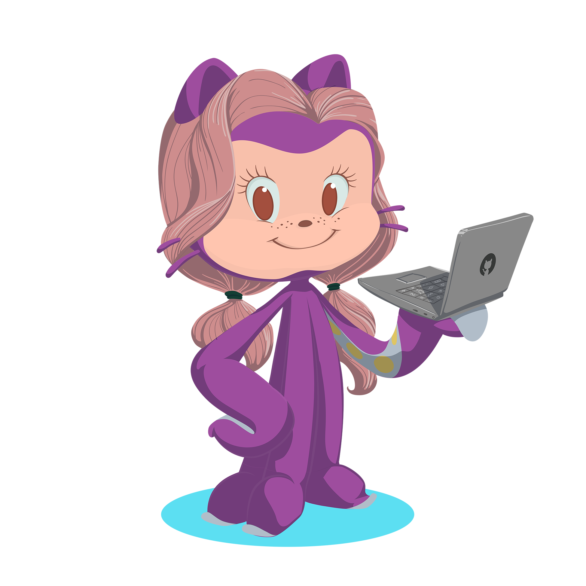

<!--
**codingCookie/codingCookie** is a ✨ _special_ ✨ repository because its `README.md` (this file) appears on your GitHub profile.

Here are some ideas to get you started:

- 🔭 I’m currently working on ...
- 🌱 I’m currently learning ...
- 👯 I’m looking to collaborate on ...
- 🤔 I’m looking for help with ...
- 💬 Ask me about ...
- 📫 How to reach me: ...
- 😄 Pronouns: ...
- ⚡ Fun fact: ...
-->

<h1 align="center">Hej 👋, I'm Melanie</h1>

<table style="margin-bottom: 50px"><tr>
<td valign="top" width="75%" >

### **About me**

- I am a **_Senior Fullstack Engineer_** and **_web3 Enthusiast_** with a **strong agile Mindset**.
- I have been working as a freelancer for various clients since mid-2020
- In addition to programming, I also have experience in corporate culture, human resources development and organizational development
- I am a multi-talent and can understand & connect tech, team & organizations, work out and communicate structures as well as added values

### **current knowledge updates**

- currently i am working deeper into the topics of _web3, blockchains, smart contracts_ etc.

<!-- ### **Entrepreneurship**

- I founded planbuddy UG with 2 others. We want to simplify the digital planning of e.g. bachelor parties and make it more stress-free. -->

</td>
<td valign="middle" width="25%"></td>
</tr></table>

## **Languages & Tools:**

  

<!-- Account age: **{{ ACCOUNT_AGE }}** years (action needed: <https://github.com/marketplace/actions/profile-readme-stats#example-workflow>) -->

## **find me on:** ️

<table><tr>
<td valign="top"></td>
<td valign="top"></td>
<td valign="top" ></td>
</tr></table>

 
 
 

   

